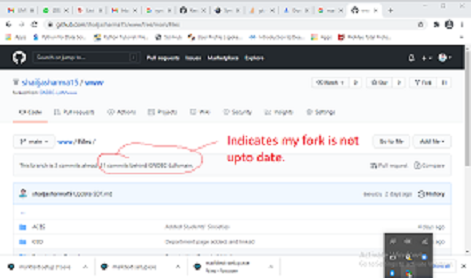
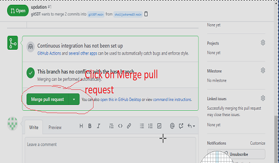
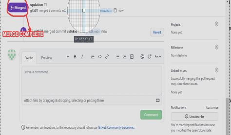

# SYNCHRONIZING FORK REPOSITORY

When you work jointly on a file of any kind like notice, project etc , there may be a situation that changes that are done to the head repository( from which you copy repository) are not present in your fork. There is a need to update the fork before continuing work.

Github has an excellent feature. There is no need to mannualy check whether your fork  is up to date or not.It is done automatically.As soon as you open repository it shows notification 

``` you are n number of commit behind ```



It Indicates your fork is not upto Date. Now,Synchronize your fork by following steps.

- Click on Compare changes


- Click on compare across forks. Choose your repository i.e your_username/repository in base and other-username/repository name in head. 


- Write the title of pull request. It's just a text to indicate actually what was changed. This text has no effect on changes.This page also shows exactly what changed has been done and on which file.


- If branch has no conflict then it shows the option of Merge Pull request. Click on it.



- Now review the changes and click on confirm Merge.



